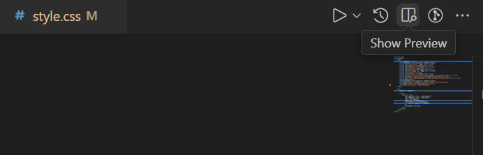
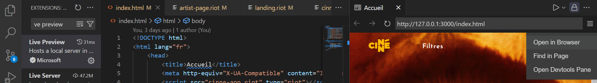
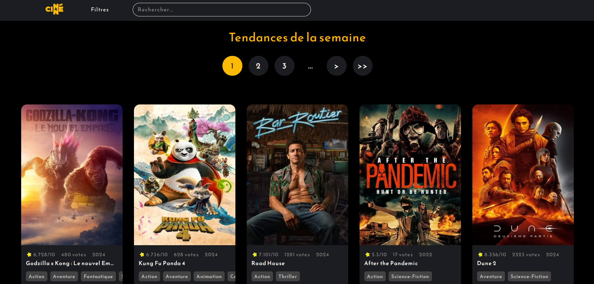
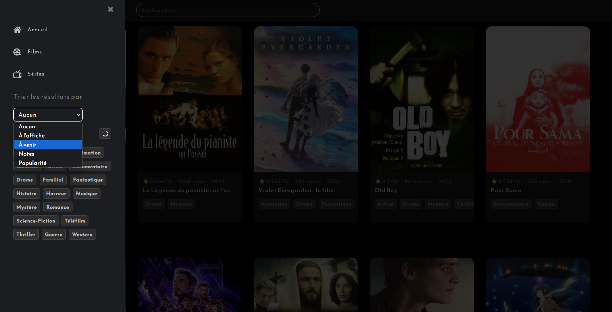
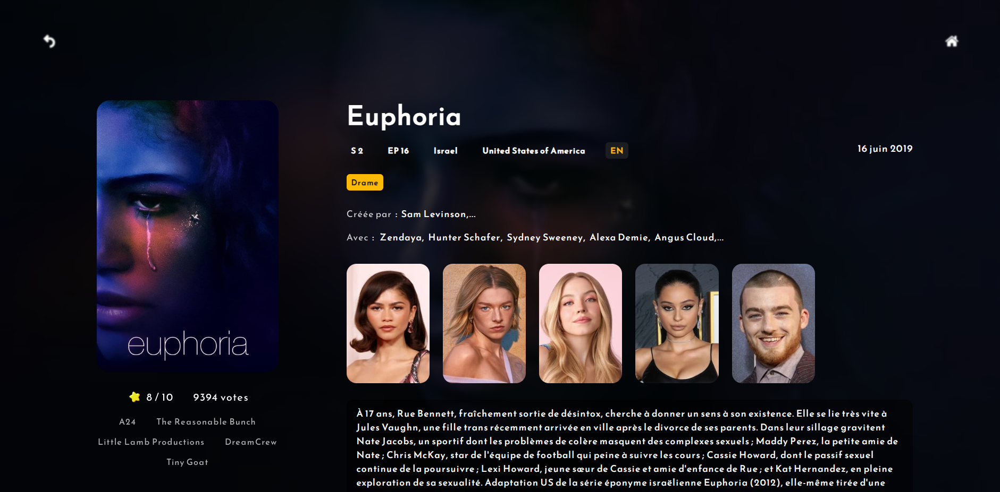
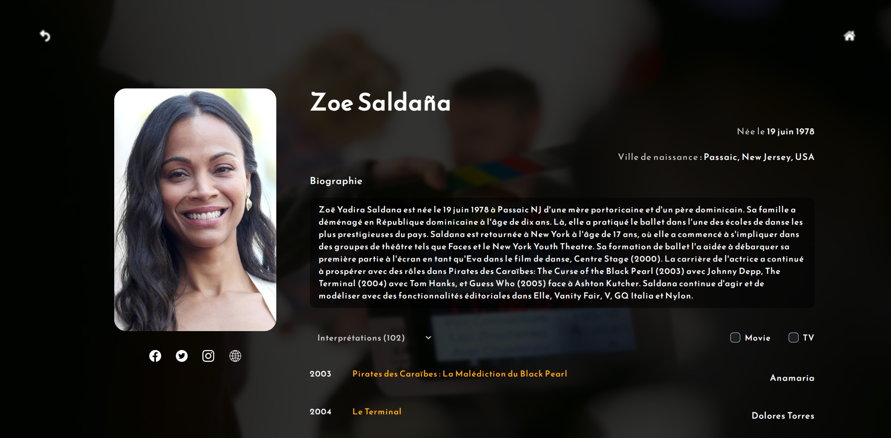

# Cinne

Site de consultation de films, séries et artistes en ligne codé entièrement avec Riot.js en HTML, CSS et JavaScript.

## Instructions

### Lancez Live Preview

 

	

 

### Ouvrez le site dans votre navigateur

 

	

 

### Consultez vos séries et films préférés.

 

	

 

### Triez-les avec plein de filtres

 

	

 

### Consultez les informations avec plus de détails

 

	

 

### Consultez également les fiches de vos acteurs favoris

 

	

## Feedback

Si vous avez des retours, contactez moi à cette adresse : nolan.toussaint77@gmail.com

## Authors

- [@Nolan](https://github.com/Naturalhg)

## License

[GNU GPL License](LICENSE)